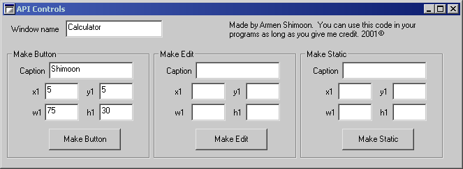



## Make API Controls

### Description

This code lets you enter the window name, then you choose what type of control to make. You enter all the stats (x,y,w,h, caption) and then it will make the control using API on the form you specified (ex. Make a button on calculator). Pretty tough to get working but was worth it! Please vote if you can. Thanks.
 
### More Info
 

             |
---                |---
**Submitted On**   |2001-06-01 15:24:38
**By**             |[Armen Shimoon](https://github.com/Planet-Source-Code/PSCIndex/blob/master/ByAuthor/armen-shimoon.md)
**Level**          |Advanced
**User Rating**    |4.0 (12 globes from 3 users)
**Compatibility**  |VB 6\.0
**Category**       |[Windows API Call/ Explanation](https://github.com/Planet-Source-Code/PSCIndex/blob/master/ByCategory/windows-api-call-explanation__1-39.md)
**World**          |[Visual Basic](https://github.com/Planet-Source-Code/PSCIndex/blob/master/ByWorld/visual-basic.md)
**Archive File**   |[Make API C20411612001\.zip](https://github.com/Planet-Source-Code/armen-shimoon-make-api-controls__1-23692/archive/master.zip)

